# Agent Architecture Documentation

## Overview

The Pre-sales Evaluator uses a sophisticated agent-based architecture powered by LangGraph to orchestrate complex workflows for both document evaluation and migration proposal generation. Each agent is designed with a single responsibility principle, making the system maintainable, testable, and scalable.

## Architecture Principles

### 1. Separation of Concerns
Each agent handles a specific task:
- **Parse Discovery Input**: Normalizes input data from various sources
- **Workload Classifier**: Analyzes and categorizes applications
- **Wave Planner**: Creates migration wave strategies
- **Migration Strategist**: Applies 6R framework with modernization bias
- **Content Generator**: Creates proposal content sections
- **Architecture Advisor**: Provides cloud architecture recommendations
- **GenAI Tool Planner**: Identifies automation opportunities
- **Sprint Effort Estimator**: Calculates project timelines and resources

### 2. Lazy LLM Initialization
All agents use module-level LLM initialization to ensure the OpenAI API key is loaded globally by the main application before any agent is imported.

### 3. Robust Error Handling
Each agent includes comprehensive error handling with fallback data to ensure the workflow continues even if individual agents encounter issues.

## Document Evaluation Workflow

```mermaid
graph TD
    A["📄 Parse Input Document"] --> B["🎯 Extract Intent & Phases"]
    B --> C["📋 Spec Checker"]
    C --> D1["🏗️ Phase 1: Strategise & Plan"]
    C --> D2["🔄 Phase 2: Migrate & Modernise"] 
    C --> D3["⚙️ Phase 3: Manage & Optimise"]
    D1 --> E["🔍 Gap Highlighter"]
    D2 --> E
    D3 --> E
    E --> F["💡 Recommendations Generator"]
    F --> G["📊 Scoring Node"]
    G --> H["✅ END"]
```



### Key Features:
- **Smart Routing**: Only evaluates relevant migration phases
- **Parallel Processing**: Multiple phases can be evaluated simultaneously
- **Comprehensive Analysis**: Spec compliance, gaps, and recommendations
- **Scoring System**: Quantitative assessment of proposal quality

## Migration Proposal Generation Workflow

```mermaid
graph TD
    A["🚀 Start: Discovery Input"] --> B["🔍 Parse Input<br/>parse_discovery_input"]
    B --> C["📊 Classify Workloads<br/>classify_workloads"]

    %% Parallel content generation
    C --> D["📝 Generate Overview<br/>generate_overview"]
    C --> E["📋 Generate Scope<br/>generate_scope"]

    %% Strategy analysis
    C --> F["🌊 Wave Planning<br/>plan_migration_waves"]
    C --> G["🎯 Migration Strategy 6Rs<br/>classify_migration_strategies"]
    G --> H["🔄 Modernisation Bias<br/>modernisation_bias"]

    %% Feedback loop: Modernisation may trigger wave replanning
    H -->|"Refactor strategies<br/>detected"| F
    H --> I["🏗️ Architecture Advisor<br/>provide_architecture_advice"]

    %% Feedback loop: Complex architecture may update scope
    I -->|"Complex patterns<br/>detected"| E

    %% GenAI and execution planning
    I --> J["🤖 GenAI Tool Planner<br/>plan_genai_tools"]
    J --> K["⏱️ Sprint Effort Estimator<br/>estimate_sprint_efforts"]

    %% Feedback loop: High effort may cause strategy reclassification
    K -->|"Effort > 1 year<br/>detected"| G

    %% Final output formatting
    K --> L["📋 Template Formatter<br/>format_proposal_sections"]
    L --> M["📄 PDF Creator<br/>create_output_files"]
    M --> Z["✅ Output"]

    %% Styling for feedback loops
    style F fill:#fff3e0,stroke:#ff9800,stroke-width:2px
    style E fill:#e8f5e8,stroke:#4caf50,stroke-width:2px
    style G fill:#fce4ec,stroke:#e91e63,stroke-width:2px
    
    %% Highlight decision points
    style H fill:#e3f2fd,stroke:#2196f3,stroke-width:3px
    style I fill:#f1f8e9,stroke:#8bc34a,stroke-width:3px
    style K fill:#fff8e1,stroke:#ffc107,stroke-width:3px
```



### Key Features:
- **Intelligent Feedback Loops**: System automatically optimizes plans through recursive analysis
- **Modernization Bias**: Detects refactor opportunities and triggers wave replanning
- **Architecture-Driven Scope Updates**: Complex patterns automatically expand project scope
- **Effort-Based Strategy Optimization**: High effort estimates trigger simpler strategy selection
- **Sequential Processing**: Each step builds on the previous analysis
- **Comprehensive Planning**: From discovery to detailed implementation
- **Multiple Output Formats**: Markdown, YAML, JSON exports
- **Professional Formatting**: Enterprise-ready proposal documents

### Recursive Intelligence:

#### 1. Modernization Bias → Wave Replanning
**Trigger**: When modernization analysis detects significant refactor opportunities
**Action**: Automatically replans migration waves to accommodate complex modernization
**Benefit**: Ensures wave planning reflects actual modernization complexity

#### 2. Architecture Complexity → Scope Updates  
**Trigger**: When architecture recommendations include complex patterns (microservices, event-driven, serverless)
**Action**: Updates project scope to include additional architecture considerations
**Benefit**: Prevents scope creep by proactively identifying complexity

#### 3. High Effort → Strategy Reclassification
**Trigger**: When effort estimates exceed 1 year or individual waves require >100 person-weeks
**Action**: Reclassifies applications to simpler migration strategies (rehost vs refactor)
**Benefit**: Keeps projects realistic and achievable within business constraints

### Optimization Tracking:
- **Feedback Loop Counter**: Tracks number of optimization cycles
- **Version Control**: Each iteration increments version number
- **Optimization Metadata**: Records which feedback loops were triggered
- **Final Optimization Status**: Shows whether plan was optimal on first pass or required optimization

## Agent Details

### Document Evaluation Agents

#### Parse Input Document (`parse_input_doc.py`)
- **Purpose**: Extract and normalize document content
- **Input**: Raw document content (PDF, DOCX, TXT)
- **Output**: Structured document data
- **Key Features**: Multi-format support, content cleaning, metadata extraction

#### Extract Intent & Phases (`extract_intent_and_phases.py`)
- **Purpose**: Identify migration intent and relevant phases
- **Input**: Parsed document content
- **Output**: Intent classification and phase routing decisions
- **Key Features**: Smart routing, phase relevance detection

#### Spec Checker (`spec_checker.py`)
- **Purpose**: Validate against Modernize.AI specification
- **Input**: Document content and phase information
- **Output**: Compliance assessment and missing elements
- **Key Features**: Comprehensive spec validation, detailed feedback

#### Phase Evaluators (`phase_evaluator.py`)
- **Purpose**: Evaluate specific migration phases
- **Input**: Document content and phase context
- **Output**: Phase-specific analysis and scores
- **Key Features**: Phase-specific criteria, detailed evaluation

#### Gap Highlighter (`gap_highlighter.py`)
- **Purpose**: Identify gaps and missing information
- **Input**: Evaluation results from all phases
- **Output**: Consolidated gap analysis
- **Key Features**: Cross-phase gap detection, prioritization

#### Recommendations Generator (`recommendations_generator.py`)
- **Purpose**: Generate actionable recommendations
- **Input**: Gap analysis and evaluation results
- **Output**: Prioritized recommendations
- **Key Features**: Actionable advice, implementation guidance

#### Scoring Node (`scoring_node.py`)
- **Purpose**: Calculate overall proposal scores
- **Input**: All evaluation results
- **Output**: Quantitative scores and metrics
- **Key Features**: Weighted scoring, multiple metrics

### Migration Proposal Generation Agents

#### Parse Discovery Input (`parse_discovery_input.py`)
- **Purpose**: Process discovery data from various sources
- **Input**: JSON, text, or manual discovery data
- **Output**: Normalized workload classification data
- **Key Features**: Multi-format parsing, data validation

#### Workload Classifier (`workload_classifier.py`)
- **Purpose**: Analyze and classify applications for migration
- **Input**: Discovery data
- **Output**: Classified workloads with complexity and readiness assessment
- **Key Features**: Technology stack analysis, migration readiness scoring

#### Content Generator (`content_generator.py`)
- **Purpose**: Generate proposal overview and scope sections
- **Input**: Classified workloads and analysis data
- **Output**: Professional proposal content sections
- **Key Features**: Executive summary, detailed scope, business value focus

#### Wave Planner (`wave_planner.py`)
- **Purpose**: Create migration wave plans using dual-track methodology
- **Input**: Classified workloads
- **Output**: Detailed wave planning with timelines and dependencies
- **Key Features**: Dual-track approach, dependency management, risk assessment

#### Migration Strategist (`migration_strategist.py`)
- **Purpose**: Apply 6R framework with modernization bias
- **Input**: Classified workloads
- **Output**: Migration strategy recommendations for each application
- **Key Features**: 6R classification, modernization opportunities, effort estimation

#### Architecture Advisor (`proposal_nodes.py`)
- **Purpose**: Provide cloud architecture recommendations
- **Input**: Migration strategies
- **Output**: Technology stack and architecture pattern recommendations
- **Key Features**: Cloud-native patterns, technology selection, best practices

#### GenAI Tool Planner (`proposal_nodes.py`)
- **Purpose**: Identify GenAI automation opportunities
- **Input**: Workloads and migration strategies
- **Output**: GenAI tool recommendations and automation opportunities
- **Key Features**: Tool categorization, ROI assessment, implementation roadmap

#### Sprint Effort Estimator (`proposal_nodes.py`)
- **Purpose**: Calculate project timelines and resource requirements
- **Input**: Migration waves and strategies
- **Output**: Sprint-based effort estimates and resource planning
- **Key Features**: Agile planning, resource allocation, milestone definition

#### Proposal Formatter (`proposal_formatter.py`)
- **Purpose**: Format and structure the final proposal
- **Input**: All analysis results
- **Output**: Professional proposal document
- **Key Features**: Template-based formatting, multiple sections, export options

## State Management

### GraphState (Document Evaluation)
```python
class GraphState(TypedDict):
    document_content: str
    document_type: str
    migration_intent: str
    relevant_phases: List[MigrationPhase]
    spec_compliance: Dict[str, Any]
    phase_evaluations: Dict[str, Any]
    gaps: List[str]
    recommendations: List[str]
    scores: Dict[str, float]
```

### ProposalState (Proposal Generation)
```python
class ProposalState(TypedDict):
    discovery_input: DiscoveryInput
    workload_classification: Dict[str, Any]
    classified_workloads: List[Dict[str, Any]]
    migration_waves: Dict[str, Any]
    migration_strategies: List[Dict[str, Any]]
    architecture_recommendations: Dict[str, Any]
    genai_recommendations: Dict[str, Any]
    effort_estimates: Dict[str, Any]
    proposal_sections: List[Dict[str, Any]]
    errors: List[str]
```

## Error Handling Strategy

### 1. Graceful Degradation
- Each agent includes fallback data for critical failures
- Workflow continues even if individual agents fail
- Partial results are preserved and displayed

### 2. Comprehensive Logging
- Detailed error messages for debugging
- Warning collection for non-critical issues
- Progress tracking for long-running operations

### 3. Validation and Recovery
- Input validation at each agent
- Data structure validation using Pydantic
- Automatic retry mechanisms for transient failures

## Performance Optimizations

### 1. Smart Content Processing
- Content limiting for faster analysis
- Parallel processing where possible
- Efficient data structures

### 2. LLM Optimization
- Model selection (GPT-4o-mini for speed and cost)
- Prompt optimization for consistent results
- Rate limiting and retry logic

### 3. Caching Strategy
- Result caching to prevent re-evaluation
- State preservation across workflow steps
- Efficient memory management

## Testing Strategy

### 1. Unit Tests
- Individual agent testing
- Mock LLM responses for consistent testing
- Edge case validation

### 2. Integration Tests
- End-to-end workflow testing
- State management validation
- Error handling verification

### 3. Performance Tests
- Load testing for document processing
- Memory usage monitoring
- Response time optimization

## Deployment Considerations

### 1. Environment Configuration
- API key management
- Environment-specific settings
- Logging configuration

### 2. Scalability
- Stateless agent design
- Horizontal scaling capability
- Resource optimization

### 3. Monitoring
- Health checks for each agent
- Performance metrics collection
- Error rate monitoring

## Future Enhancements

### 1. Advanced Routing
- Conditional workflows based on content analysis
- Feedback loops for iterative improvement
- Dynamic agent selection

### 2. Enhanced AI Capabilities
- Multi-modal document processing
- Advanced reasoning capabilities
- Custom model fine-tuning

### 3. Integration Capabilities
- API endpoints for external integration
- Webhook support for notifications
- Database integration for persistence

This architecture provides a robust, scalable foundation for both document evaluation and migration proposal generation, with clear separation of concerns and comprehensive error handling. 