# LangGraph Workflow Architecture

## Overview
The Pre-Sales Document Evaluator uses a sophisticated LangGraph workflow to intelligently route document evaluation based on content relevance. This ensures efficient processing by only evaluating relevant migration phases.

## Workflow Diagram

```mermaid
graph TD
    A["📄 START"] --> B["🔍 Parse Input Document<br/>(parse_input_doc)"]
    B --> C["🎯 Extract Intent & Phases<br/>(extract_intent_and_phases)"]
    
    C --> D{"🔀 Conditional Routing<br/>Based on Content Relevance<br/>(confidence > 0.5)"}
    
    D -->|"Strategise & Plan<br/>Content Found"| E["📋 Strategise & Plan<br/>Evaluator"]
    D -->|"Migrate & Modernise<br/>Content Found"| F["🚀 Migrate & Modernise<br/>Evaluator"]
    D -->|"Manage & Optimise<br/>Content Found"| G["⚙️ Manage & Optimise<br/>Evaluator"]
    
    E --> H["✅ Spec Checker<br/>(spec_checker)"]
    F --> H
    G --> H
    
    H --> I["🔍 Gap Highlighter<br/>(gap_highlighter)"]
    I --> J["💡 Recommendations Generator<br/>(recommendations_generator)"]
    J --> K["📊 Scoring Node<br/>(scoring)"]
    K --> L["🏁 END"]
    
    style A fill:#e1f5fe
    style L fill:#e8f5e8
    style D fill:#fff3e0
    style E fill:#f3e5f5
    style F fill:#e8f5e8
    style G fill:#fff8e1
    style H fill:#e3f2fd
    style I fill:#fce4ec
    style J fill:#f1f8e9
    style K fill:#e0f2f1
```



## Node Descriptions

### 1. **Parse Input Document** (`parse_input_doc`)
- **Purpose**: Extracts content from uploaded files (PDF, DOCX, TXT, MD)
- **Output**: Structured `ParsedDocument` with content, sections, and metadata
- **Key Features**: 
  - Multi-format support
  - Section detection
  - Metadata extraction

### 2. **Extract Intent & Phases** (`extract_intent_and_phases`)
- **Purpose**: Analyzes document content to identify relevant migration phases
- **AI Model**: GPT-4o-mini
- **Output**: Phase content mapping with confidence scores
- **Key Logic**: 
  - Content analysis for each migration phase
  - Confidence scoring (0.0 - 1.0)
  - Relevant content extraction

### 3. **Conditional Routing** (Smart Decision Point)
- **Purpose**: Intelligently routes to only relevant phase evaluators
- **Logic**: Only evaluates phases with confidence > 0.5
- **Fallback**: If no phases meet threshold, evaluates highest-scoring phase
- **Benefits**: 
  - Faster processing
  - Reduced API calls
  - More focused evaluation

### 4. **Phase Evaluators** (Conditional Execution)

#### **Strategise & Plan Evaluator**
- **Scope**: Discovery, assessment, strategic planning, business case
- **Criteria**: Strategic alignment, planning quality, stakeholder engagement

#### **Migrate & Modernise Evaluator**
- **Scope**: Migration execution, AI-assisted modernisation, validation
- **Criteria**: Technical approach, automation, modernisation strategy

#### **Manage & Optimise Evaluator**
- **Scope**: Operations, cost optimization, security, continuous improvement
- **Criteria**: Operational excellence, optimization approach, governance

### 5. **Spec Checker** (`spec_checker`)
- **Purpose**: Validates compliance against Modernize.AI specification
- **Input**: All phase evaluations
- **Output**: Compliance assessment and missing elements
- **Reference**: `src/config/modernize_ai_spec.yaml`

### 6. **Gap Highlighter** (`gap_highlighter`)
- **Purpose**: Identifies and categorizes gaps in the proposal
- **Severity Levels**: Critical, High, Medium, Low
- **Output**: Structured gap analysis with impact assessment

### 7. **Recommendations Generator** (`recommendations_generator`)
- **Purpose**: Generates actionable recommendations to address gaps
- **Priority Levels**: Critical, High, Medium, Low
- **Output**: Prioritized recommendations with implementation guidance

### 8. **Scoring Node** (`scoring`)
- **Purpose**: Calculates final scores and creates evaluation summary
- **Scoring Scale**: 0-3 for each phase
- **Output**: Complete `EvaluationResult` with scorecard and summary

## Key Features

### **Intelligent Routing**
- **Confidence Threshold**: 0.5 (adjustable)
- **Content Analysis**: LLM-powered phase relevance detection
- **Efficiency**: Only processes relevant phases
- **Fallback Logic**: Ensures at least one phase is evaluated

### **State Management**
- **GraphState**: Centralized state management across nodes
- **Concurrent Updates**: Handles multiple phase evaluators safely
- **Error Handling**: Graceful degradation with partial results

### **Performance Optimizations**
- **Content Limiting**: 2000 characters for phase extraction
- **Selective Evaluation**: Only relevant phases processed
- **Fast Model**: GPT-4o-mini for speed
- **Parallel Processing**: Phase evaluators run concurrently when applicable

## Configuration

### **Model Settings**
- **Primary Model**: GPT-4o-mini
- **Temperature**: 0 (deterministic)
- **Content Limit**: 2000 characters for analysis

### **Routing Thresholds**
- **Phase Confidence**: > 0.5
- **Fallback**: Highest scoring phase if none meet threshold

### **Specification Files**
- **Migration Spec**: `src/config/modernize_ai_spec.yaml`
- **SOW Spec**: `src/config/sow_spec.yaml`

## Usage Example

```python
from src.graph.evaluation_graph import EvaluationOrchestrator

# Initialize orchestrator
orchestrator = EvaluationOrchestrator()

# Evaluate document
result = orchestrator.evaluate_document(file_content, filename)

if result["success"]:
    evaluation = result["evaluation_result"]
    print(f"Overall Score: {evaluation.overall_score}/3.0")
    print(f"Compliance: {evaluation.spec_compliance.overall_compliance_score:.1%}")
else:
    print(f"Error: {result['error']}")
```

## Error Handling

The workflow includes comprehensive error handling:
- **Parsing Errors**: Graceful fallback for malformed documents
- **LLM Failures**: JSON parsing with multiple fallback strategies
- **State Errors**: Partial result extraction for debugging
- **Timeout Handling**: Configurable timeouts for long-running operations

## Future Enhancements

- **Additional Document Types**: RFP responses, technical proposals
- **Custom Routing Logic**: User-defined evaluation criteria
- **Parallel Phase Processing**: Enhanced concurrency for large documents
- **Caching**: Result caching for repeated evaluations 